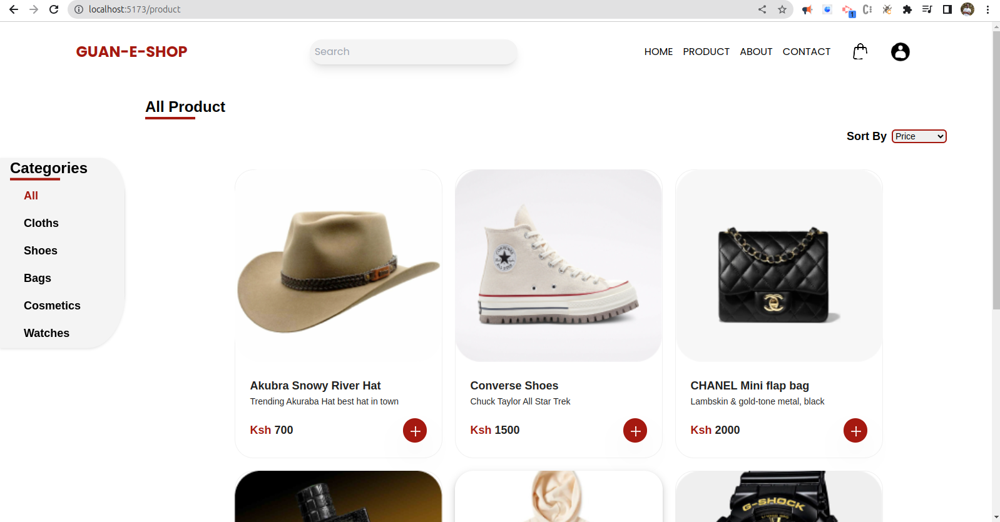

#### GUAN-E-SHOP
The Guan-E-Shop is an E-Commerce Web application where users are able to browse through a list of products, add them to their cart and checkout. The application is built using the MERN stack (MongoDB, Express, React, Node.js).

### Features
- User Authentication
- Product Search
- Product Pagination
- Shopping Cart
- Checkout Process (Shipping, Payment Method, Place Order)
- Order History
- Admin Panel (Product Management, User Management, Order Management, User Profile Management)

### Technologies Used
- React
- Node.js
- Express
- MongoDB
- Mongoose

### How to run the application
1. Clone the repository
2. Install dependencies
```
npm install
cd frontend
npm install
```
3. Run the application
```
npm run dev
```
<!-- Screenshot from 2023-07-03 09-50-30.png -->
### Screenshots





